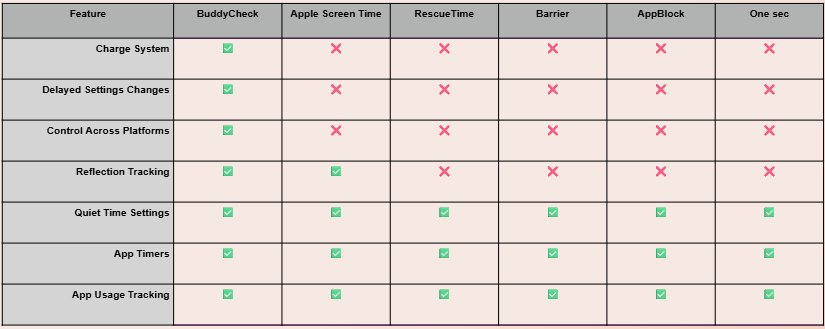

<!-- HEADER SECTION -->

  <h1 style="color: white; margin-bottom: 0.5rem;">Competition Matrix</h1>
  

<!-- NAVIGATION BAR -->

  <a href="index.html">Home</a>
  <a href="team.html">Team</a>
  

    Presentations ▼
    

      <a href="feasibility-draft-1.html">Feasibility Draft 1</a>
      <a href="feasibility-draft-2.html">Feasibility Draft 2</a>
      <a href="feasibility-draft-3.html">Feasibility Draft 3</a>
      <a href="design-draft-1.html">Design Draft 1</a>
      <a href="design-draft-2.html">Design Draft 2</a>
      <a href="design-draft-3.html">Design Draft 3</a>
    

  

  

    Labs ▼
    

      <a href="labs.html">Lab 1 Outline</a>
    

  

  

    Deliverables ▼
    

      <a href="deliverables-overview.html">Overview</a>
      <a href="deliverables-process-flow.html">Process Flow</a>
      <a href="deliverables-mfcd.html">MFCD</a>
      <a href="deliverables-risk-matrix.html">Risk Matrix</a>
      <a href="deliverables-competition.html">Competition</a>
      <a href="deliverables-user-roles.html">User Roles & Stories</a>
      <a href="deliverables-ui-mockups.html">UI Mockups</a>
      <a href="deliverables-algorithms.html">Algorithm Flows</a>
    

  

  <a href="glossary.html">Glossary</a>
  <a href="references.html">References</a>

# 🥇 Competition Matrix

Buddy Check exists in a landscape of apps focused on reducing screen time and digital distractions. However, it offers a unique approach compared to its competitors.

---

## 🔍 How Buddy Check Stands Out

While apps like **AppBlock**, **One Sec**, or **RescueTime** rely on complete blocking, passive tracking, or lockouts, **Buddy Check** focuses on **intentional behavior change** and **flexibility**. 

It is not designed to punish users, but to gently **interrupt bad habits**, prompt **reflection**, and create long-term improvements through positive feedback and user empowerment.

---

## 🧩 Key Differentiators

- **Air Tank System**: Encourages mindful app use instead of total bans.
- **Quiet Hours**: Blocks apps and notifications only during user-selected times.
- **Weekly Reflections**: Helps users track progress and stay motivated.
- **Settings Delay**: Prevents impulsive unblocking or overuse.
- **Cross-platform support**: Works across mobile and desktop environments.

> Buddy Check is not about taking control away from users — it's about giving them the tools to **stay in control**.

<!-- FOOTER -->

  © 2025 Buddy Check Project · Designed by CS 410 Team at ODU

<footer style="text-align: center; font-size: 0.9rem; padding: 1rem 0; color: #444;">
  <a href="https://www.odu.edu/" target="_blank">Old Dominion University</a> |
  <a href="https://www.odu.edu/computer-science" target="_blank">ODU Computer Science Department</a>
</footer>

