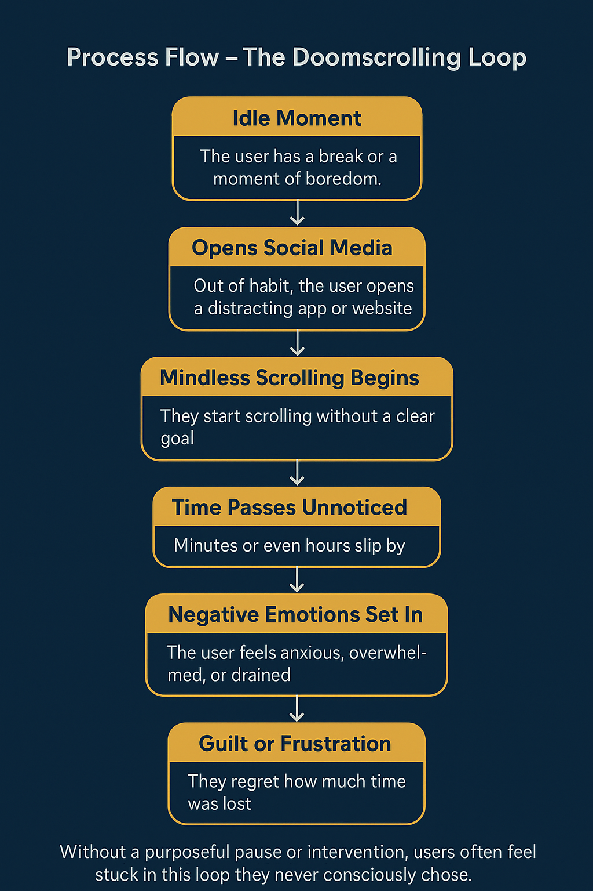
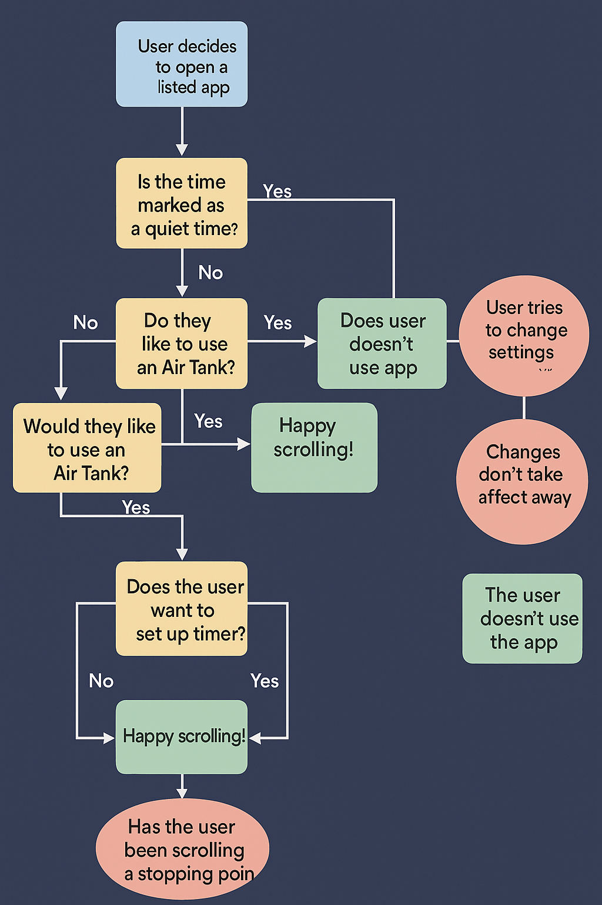
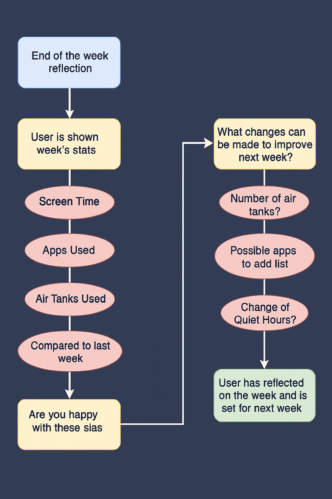

<!-- HEADER SECTION -->

  <h1 style="color: white; margin-bottom: 0.5rem;">Process Flow</h1>
  

<!-- NAVIGATION BAR -->

  <a href="index.html">Home</a>
  <a href="team.html">Team</a>
  

    Presentations ▼
    

      <a href="feasibility-draft-1.html">Feasibility Draft 1</a>
      <a href="feasibility-draft-2.html">Feasibility Draft 2</a>
      <a href="feasibility-draft-3.html">Feasibility Draft 3</a>
      <a href="design-draft-1.html">Design Draft 1</a>
      <a href="design-draft-2.html">Design Draft 2</a>
      <a href="design-draft-3.html">Design Draft 3</a>
    

  

  

    Labs ▼
    

      <a href="labs.html">Lab 1 Outline</a>
    

  

  

    Deliverables ▼
    

      <a href="deliverables-overview.html">Overview</a>
      <a href="deliverables-process-flow.html">Process Flow</a>
      <a href="deliverables-mfcd.html">MFCD</a>
      <a href="deliverables-risk-matrix.html">Risk Matrix</a>
      <a href="deliverables-competition.html">Competition</a>
    

  

  <a href="glossary.html">Glossary</a>
  <a href="references.html">References</a>

# 🔁 Buddy Check Process Flows

## 🔄 Process Flow – The Doomscrolling Loop

Even with the best intentions, many people fall into the same destructive pattern when using social media. This flow illustrates the unconscious loop of doomscrolling — from a moment of boredom to guilt and burnout.

Without tools in place to interrupt or reflect, this cycle repeats daily, chipping away at productivity, well-being, and emotional energy.

> Buddy Check is designed specifically to **break this loop** by introducing intentional steps, prompts, and friction at just the right moments.

---

## 📅 Daily Solution Flow – Using Buddy Check Day-to-Day

The daily process begins when a user opens a listed app or website:

1. **Air Tank Prompt**: A pop-up appears asking if they want to use one of their limited daily “air tanks” to begin a scrolling session.
2. **Optional Timer**: If desired, the user can set a countdown timer. This adds structure and limits impulsive overuse.
3. **Session Begins**: Scrolling is allowed as normal.
4. **Breathing Breaks**: After a prolonged session, a gentle pop-up reminds the user to pause and reflect.
5. **Session Ends**: When the app is closed or time expires, the tank is marked as used. If all tanks are used for the day, access is blocked.

> This daily loop creates intentional moments of decision and breaks the unconscious doomscrolling habit.

---

## 📈 Weekly Solution Flow – Reflecting and Adjusting

At the end of each week, the app initiates a user reflection process:

1. **Usage Stats**: Screen time and scrolling activity from the past 7 days is displayed.
2. **Reflection Prompt**: The user is asked to consider how satisfied they are with their usage.
3. **Adjustments**: Suggestions are made (e.g., add/remove apps from the restricted list).
4. **Goal Reminders**: The app reminds the user why they wanted to change their habits in the first place.

> Weekly reflections keep personal goals front and center, helping users develop a more mindful relationship with technology over time.

<!-- FOOTER -->

  © 2025 Buddy Check Project · Designed by CS 410 Team at ODU

<footer style="text-align: center; font-size: 0.9rem; padding: 1rem 0; color: #444;">
  <a href="https://www.odu.edu/" target="_blank">Old Dominion University</a> |
  <a href="https://www.odu.edu/computer-science" target="_blank">ODU Computer Science Department</a>
</footer>
