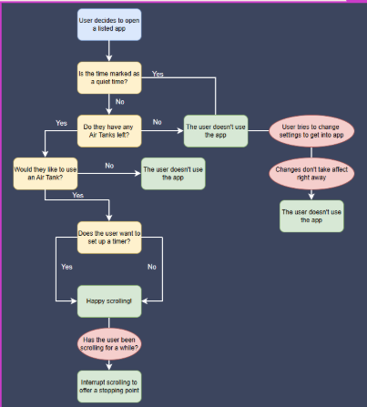
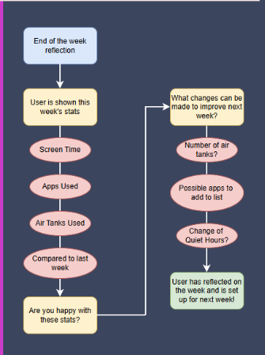

  <a href="index.html">Home</a>
  <a href="team.html">Team</a>
  <a href="presentations.html">Presentations</a>

  

    Deliverables ▼
    

      <a href="deliverables-overview.html">Overview</a>
      <a href="deliverables-process-flow.html">Process Flow</a>
      <a href="deliverables-mfcd.html">MFCD</a>
      <a href="deliverables-risk-matrix.html">Risk Matrix</a>
      <a href="deliverables-competition.html">Competition</a>
    

  

# 🔁 Buddy Check Process Flows

## 📅 Daily Flow – Using Buddy Check Day-to-Day

The daily process begins when a user opens a listed app or website:

1. **Air Tank Prompt**: A pop-up appears asking if they want to use one of their limited daily “air tanks” to begin a scrolling session.
2. **Optional Timer**: If desired, the user can set a countdown timer. This adds structure and limits impulsive overuse.
3. **Session Begins**: Scrolling is allowed as normal.
4. **Breathing Breaks**: After a prolonged session, a gentle pop-up reminds the user to pause and reflect.
5. **Session Ends**: When the app is closed or time expires, the tank is marked as used. If all tanks are used for the day, access is blocked.

> This daily loop creates intentional moments of decision and breaks the unconscious doomscrolling habit.

---

## 📈 Weekly Flow – Reflecting and Adjusting

At the end of each week, the app initiates a user reflection process:

1. **Usage Stats**: Screen time and scrolling activity from the past 7 days is displayed.
2. **Reflection Prompt**: The user is asked to consider how satisfied they are with their usage.
3. **Adjustments**: Suggestions are made (e.g., add/remove apps from the restricted list).
4. **Goal Reminders**: The app reminds the user why they wanted to change their habits in the first place.

> Weekly reflections keep personal goals front and center, helping users develop a more mindful relationship with technology over time.

