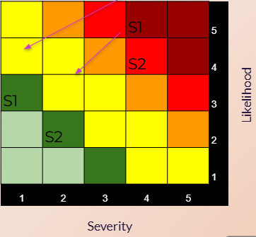
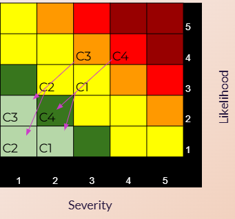

  <h1 style="color: white; margin-bottom: 0.5rem;">Buddy Check – Before the Doom Scroll</h1>
  
Helping people reclaim time by interrupting doomscrolling habits.

  <a href="index.html">Home</a>
  <a href="team.html">Team</a>
  <a href="presentations.html">Presentations</a>

  

    Deliverables ▼
    

      <a href="deliverables-overview.html">Overview</a>
      <a href="deliverables-process-flow.html">Process Flow</a>
      <a href="deliverables-mfcd.html">MFCD</a>
      <a href="deliverables-risk-matrix.html">Risk Matrix</a>
      <a href="deliverables-competition.html">Competition</a>
    

  

  <a href="glossary.html">Glossary</a>
  <a href="references.html">References</a>
 

# ⚠️ Risk Matrices

Buddy Check faces a variety of risks in its development and deployment. These are categorized into three main areas:

---

## 🔒 Security Risk Matrix

These risks deal with data privacy and user trust.

- **S1**: The app may request more permissions than needed, causing users to worry about surveillance or data misuse.  
  → *Mitigation*: Clearly disclose permissions and limit requests to only what’s essential.

- **S2**: There's a risk of user tracking data being misused or sold.  
  → *Mitigation*: Implement full encryption and store data locally or in a user-controlled environment.

---

## 👥 Customer Risk Matrix

These risks relate to user engagement and satisfaction.

- **C1**: Users might ignore or dismiss check-in prompts.  
  → *Mitigation*: Make reminders customizable and friendly.

- **C2**: Weekly reflections could feel judgmental or stressful.  
  → *Mitigation*: Design feedback with supportive, motivational language.

- **C3**: The app may be too complex for older or non-technical users.  
  → *Mitigation*: Use simple onboarding, default settings, and tutorials.

- **C4**: Some users might uninstall Buddy Check too soon.  
  → *Mitigation*: Encourage gradual behavior change and celebrate small wins.

---

## 🛠️ Technical Risk Matrix

These focus on development challenges and platform issues.

- **T1**: Syncing data across platforms (iOS, Android, PC) could be difficult.  
  → *Mitigation*: Use a centralized cloud database and device-specific tokens.

- **T2**: Platform APIs may complicate features like settings delay.  
  → *Mitigation*: Break down the logic by OS and stagger implementation.

- **T3**: Bugs in timers or logic could affect app reliability.  
  → *Mitigation*: Write automated unit tests and conduct QA regularly.

- **T4**: App store approvals may delay launch.  
  → *Mitigation*: Prepare early and follow guidelines for each store.

