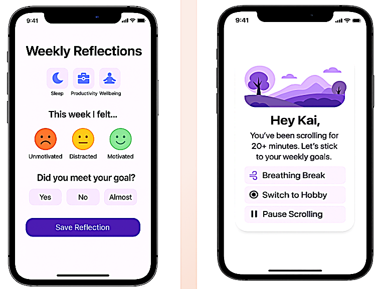

<!-- HEADER SECTION -->

  <h1 style="color: white; margin-bottom: 0.5rem;">UI Mockups</h1>
  
Final visual layout of Buddy Check’s core screens

<!-- NAVIGATION BAR -->

  <a href="index.html">Home</a>
  <a href="team.html">Team</a>
  

    Presentations ▼
    

      <a href="feasibility-draft-1.html">Feasibility Draft 1</a>
      <a href="feasibility-draft-2.html">Feasibility Draft 2</a>
      <a href="feasibility-draft-3.html">Feasibility Draft 3</a>
      <a href="design-draft-1.html">Design Draft 1</a>
      <a href="design-draft-2.html">Design Draft 2</a>
      <a href="design-draft-3.html">Design Draft 3</a>
    

  

  

    Labs ▼
    

      <a href="labs.html">Lab 1 Outline</a>
    

  

  

    Deliverables ▼
    

      <a href="deliverables-overview.html">Overview</a>
      <a href="deliverables-process-flow.html">Process Flow</a>
      <a href="deliverables-mfcd.html">MFCD</a>
      <a href="deliverables-risk-matrix.html">Risk Matrix</a>
      <a href="deliverables-competition.html">Competition</a>
      <a href="deliverables-user-roles.html">User Roles & Stories</a>
      <a href="deliverables-ui-mockups.html">UI Mockups</a>
      <a href="deliverables-algorithms.html">Algorithm Flows</a>
    

  

  <a href="glossary.html">Glossary</a>
  <a href="references.html">References</a>

<!-- MAIN CONTENT -->

  
The following mockups illustrate key screen designs from Buddy Check, focusing on usability and minimal distraction. These visuals were finalized in Design Iteration 3 and reflect real-time behavior support for users, partners, and reflections.

  <h3>📱 Preview Screens</h3>

  
<strong>Welcome & Sign-In:</strong> Introduces users to Buddy Check and leads them into personalized setup. Clean layout and branding help the user feel at ease immediately.

  

  
<strong>Settings, Goals, and App Selection:</strong> Lets users define sleep, productivity, and social wellness targets while configuring Air Tank app limits. Personal control is a core theme here.

  

  
<strong>Weekly Reflections & Break Prompts:</strong> Helps users assess their mood and goal success weekly. Also includes an intervention screen when doomscrolling is detected to gently suggest better choices.

  

  
<strong>Dashboards & Visual Progress:</strong> Gives users a sense of momentum through daily usage tracking, goal snapshots, and tank availability. Visual charts keep motivation clear and tangible.

  

  
<strong>Screen Time Breakdown:</strong> Final screens give insight into individual app usage over time. This reinforces awareness and supports behavior change based on real data.

  

<!-- FOOTER -->

  © 2025 Buddy Check Project · Designed by CS 410 Team at ODU

<footer style="text-align: center; font-size: 0.9rem; padding: 1rem 0; color: #444;">
  <a href="https://www.odu.edu/" target="_blank">Old Dominion University</a> |
  <a href="https://www.odu.edu/computer-science" target="_blank">ODU Computer Science Department</a>
</footer>
