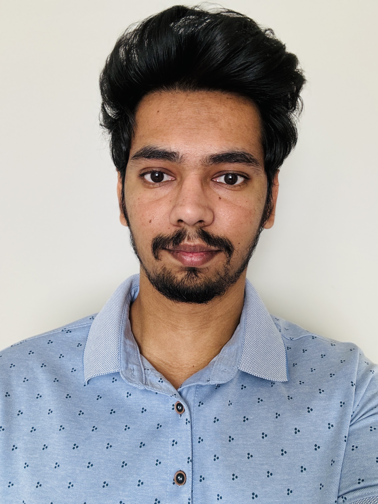

<!-- Page Styles -->

<!-- NAVIGATION BAR -->

  <a href="index.html">Home</a>
  <a href="team.html">Team</a>
  

    Presentations ▼
    

      <a href="feasibility-draft-1.html">Feasibility Draft 1</a>
      <a href="feasibility-draft-2.html">Feasibility Draft 2</a>
      <a href="feasibility-draft-3.html">Feasibility Draft 3</a>
    

  

  

    Labs ▼
    

      <a href="labs.html">Lab 1 Outline</a>
    

  

  

    Deliverables ▼
    

      <a href="deliverables-overview.html">Overview</a>
      <a href="deliverables-process-flow.html">Process Flow</a>
      <a href="deliverables-mfcd.html">MFCD</a>
      <a href="deliverables-risk-matrix.html">Risk Matrix</a>
      <a href="deliverables-competition.html">Competition</a>
    

  

  <a href="glossary.html">Glossary</a>
  <a href="references.html">References</a>

<!-- Team Members Section -->

  

    
    

      <h3>Nicholas Brewster</h3>
      
Nicholas is a senior at Old Dominion University majoring in computer science and plans to graduate in Spring 2026. He earned his Associate of Science from Tidewater Community College with Magna Cum Laude honors. He aims to become a software engineer. In his free time, he enjoys gaming and spending time with his cat, Ollie.

    

  

  

    
    

      <h3>Daksh Patel</h3>
      
Daksh is a Computer Science student at ODU graduating in December 2025. With a prior degree in Computer Engineering from Canada, he's the technical lead for Buddy Check. His strengths lie in Java, front-end design, and UI/UX. He's passionate about building tools that encourage healthy digital habits.

    

  

  

    
    

      <h3>Balemual Ymamu</h3>
      
Balemual is a senior at ODU majoring in CS with a cybersecurity minor, set to graduate in Fall 2025. He earned an Associate of Science from Tidewater Community College. He's passionate about software engineering and enjoys soccer and socializing in his spare time.

    

  

  

    
    

      <h3>Augustine Kpewa</h3>
      
Augustine is a CS senior at ODU, graduating in Fall 2025. He holds an Associate Degree in CS from Northern Virginia Community College. He's proficient in Java, Python, C++, and web development. Outside of class, he enjoys soccer and fitness.

    

  

  

    
    

      <h3>Dustin Melton-Dobson</h3>
      
Dustin is a CS senior at ODU with an associate degree in CS from NOVA. He’s skilled in Java and has working knowledge of Python, C++, and HTML. He enjoys golf and walking his dog in his free time.

    

  

<!-- Footer -->

  © 2025 Buddy Check Project · Designed by CS 410 Team at ODU

<footer style="text-align: center; font-size: 0.9rem; padding: 1rem 0; color: #444;">
  <a href="https://www.odu.edu/" target="_blank">Old Dominion University</a> |
  <a href="https://www.odu.edu/computer-science" target="_blank">ODU Computer Science Department</a>
</footer>
