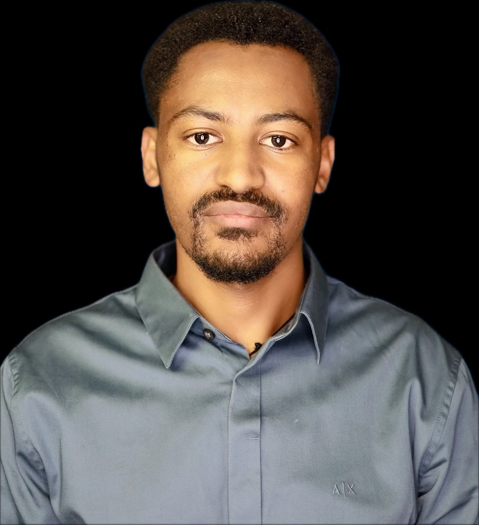

  <h1 style="color: white; margin-bottom: 0.5rem;">Buddy Check – Before the Doom Scroll</h1>
  
Helping people reclaim time by interrupting doomscrolling habits.

  <a href="index.html">Home</a>
  <a href="team.html">Team</a>
  <a href="presentations.html">Presentations</a>

  

    Deliverables ▼
    

      <a href="deliverables-overview.html">Overview</a>
      <a href="deliverables-process-flow.html">Process Flow</a>
      <a href="deliverables-mfcd.html">MFCD</a>
      <a href="deliverables-risk-matrix.html">Risk Matrix</a>
      <a href="deliverables-competition.html">Competition</a>
    

  

---

## Team Buddy Check

### Nicholas Brewster

  
  

    <h3>Nicholas Brewster</h3>
    
Nicholas Brewster is a senior at Old Dominion University majoring in computer science with plans to graduate in spring 2026. He obtained his Associates of Science degree from Tidewater Community College, graduating Magna Cum Laude, with plans to be a software engineer eventually. In his free time, Nicholas likes to play video games, hang out with friends, listen to his cat, Ollie, yell for more food.

  

### Daksh Patel

  
  

    <h3>Daksh Patel</h3>
    
Daksh Patel is a Computer Science student at Old Dominion University and the technical lead for Buddy Check, planning to graduate in December 2025. He previously completed a four-year undergraduate degree in Computer Engineering in Canada, where he developed a solid foundation in both hardware and software principles. Drawing from that experience, Daksh brings a strong background in Java, front-end development, and UI/UX design. His disciplined approach is also shaped by time spent in contributing to his structured work ethic and leadership skills. Aspiring to become a software developer, Daksh is passionate about creating impactful, user-centered applications that help people live more intentional digital lives.

  

### Balemual Ymamu

  
  

    <h3>Balemual Ymamu</h3>
    
Balemual is a senior at Old Dominion University majoring in computer science with a minor in cybersecurity, and he plans to graduate in Fall 2025. He earned his Associate of Science degree from Tidewater Community College in Fall 2023. Balemual is passionate about technology and aims to pursue a career as a software engineer. In his free time, he enjoys playing soccer and hanging out with friends.

  

### Augustine Kpewa

  

    <h3>Augustine Kpewa</h3>
    
Augustine is a Computer Science senior at Old Dominion University, graduating in Fall 2025, with a focus on software development. He holds an Associate Degree in Computer Science from Northern Virginia Community College, earned in Spring 2023. Skilled in Java, Python, C++, and web development, he is preparing for a career in software engineering. Outside of academics, he enjoys playing soccer and staying active through fitness training.

  

### Dustin Melton-Dobson

  

    <h3>Dustin Melton-Dobson</h3>
    
Dustin is a senior studying computer science at Old Dominion University.  He holds an associate in computer science from Northern Virginia Community College.  He has a strong java background and a working knowledge of python, c++, and HTML.  In his free time, Dustin enjoys playing competitive golf and walking his dog.

  

